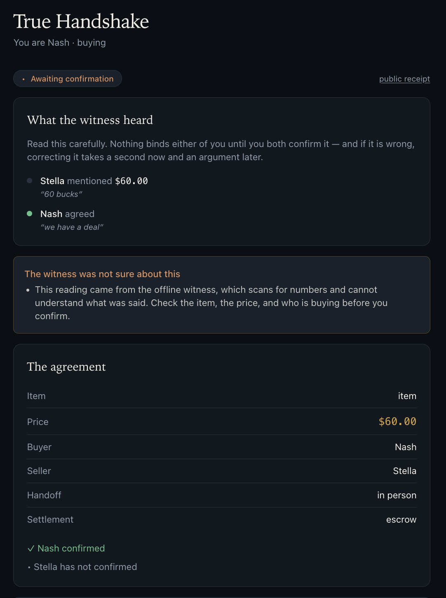

<p align="center">
  
</p>

# True Handshake

**An AI witness for two-party deals, and a receipt anyone can verify.**

Two people negotiate out loud. True Handshake listens, reconstructs what they
agreed — every price named, in order, in their own words — and puts that reading
in front of both of them. When they both confirm it, the agreement is frozen,
hashed, and signed. Then it holds the buyer's money until the item actually
changes hands.

```
Nash:   Hey Stella — I like your fitbit, how much is it?
Stella: Well I got it for $80
Nash:   Well how much is it today?
Stella: Nash, if you want it, maybe 50
Nash:   I will offer you 30
Stella: That's too low. How about 40
Nash:   We have a deal
```

From that, the witness produces:

| # | Who | What | Words |
|---|---|---|---|
| 0 | Stella | mentioned $80 | *"well I got it for $80"* |
| 1 | Stella | asked $50 | *"if you want it maybe 50"* |
| 2 | Nash | offered $30 | *"I will offer you 30"* |
| 3 | Stella | countered **$40** | *"That's too low, how about 40"* |
| 4 | Nash | agreed | *"We have a deal"* |

That ladder is the point. Any escrow can record "both parties agreed to $40".
True Handshake records how they got there, attributed and quoted, so the receipt
is worth more than a checkbox.

And this is what both parties see before anything binds — the ladder, the
witness's own caveats, and two confirmations that have to arrive separately:

<p align="center">
  
</p>

---

## The rule everything hangs off

> **The witness proposes. The humans attest. The chain records.**

An AI reading of a conversation is **never binding on its own**. It is evidence
put in front of two people, who confirm or correct it. Only then is it frozen and
hashed. A mis-transcribed "forty" can never become a $40 obligation without both
parties looking at it first — and if either corrects anything, *both*
confirmations are withdrawn and they confirm again.

This matters because "the AI is the trust" and "you don't have to trust anyone"
pull in opposite directions. True Handshake resolves it by making the AI a
**witness that produces evidence**, never an authority that decides.

---

## The lifecycle

```
     ┌─ witness listens ─┐
Draft ──────────────────► PendingAgreement ──both confirm──► Agreed
                              │  ▲                             │
                     correct ─┘  │ (resets both)         buyer funds
                                 │                             ▼
                                 └─────────────────────────► Funded
                                                               │
                                                    seller proves handoff
                                                               ▼
                                                        HandoffProved
                                                               │
                                                     buyer confirms receipt
                                                               ▼
                                    ┌───────────────────► Holding ──24h──► Completed
                                    │                        │
                              (withdrawn)                  dispute
                                    │                        ▼
                                    └──────────────────── Disputed ──► Resolved
```

**The 24-hour hold is the safety valve.** Between "I have it" and the money
moving, either party can freeze the transfer by disputing. Nobody can pressure
anyone with a countdown running, because opening a dispute stops the clock.

Deals cannot hang. A silent seller means the buyer is refunded automatically. A
silent buyer means the release clock starts anyway — but the receipt is labelled
*receipt never confirmed*, permanently and on its face.

---

## What a receipt proves, and what it does not

Every deal produces a public receipt at `/v/{id}`, readable with no account.
Verification runs **in your browser**, against a key published at
`/.well-known/true-handshake-keys.json`:

```
payload_hash[n]    = hex(SHA-256(canonical_json(payload[n])))
prev_chain_hash[0] = hex(SHA-256("true-handshake/v1/genesis:" || deal_id))
prev_chain_hash[n] = chain_hash[n-1]
chain_hash[n]      = hex(SHA-256(prev_chain_hash[n] || payload_hash[n]))
signature[n]       = Ed25519(key, "true-handshake/v1/attestation:" || chain_hash[n])
```

**It proves** both parties agreed to exactly these terms, precisely when each of
them consented, that nobody — including us — has altered the record since, and
(when a recording was captured) that the transcript came from a specific audio
track whose fingerprint is fixed in the chain.

**It does not prove** the item matched its description, or that money moved. v1
settles on the `attested` tier: signed claims, not observed transfers. Swapping
the mock ledger for a real PSP promotes the tier to `observed` **with no change
to the domain model**; that seam is `SettlementProvider` in `th-app/src/ports.rs`.

Two design decisions worth knowing about:

- **Genesis is domain-separated by deal id.** Without it, two deals whose first
  payloads happened to be identical would produce identical chain hashes and
  therefore identical signatures — letting an attestation be transplanted between
  deals.
- **Hashes concatenate as lowercase ASCII hex, not raw bytes.** Slightly
  wasteful, deliberately so: an independent verifier reimplements string
  concatenation without a single byte-order question. `web/src/lib/verify.ts` is
  a second implementation written against the spec, not the Rust source. If the
  two ever disagree, the *format* is what's wrong.

---

## Getting it running

### What you need

| | Version | Notes |
|---|---|---|
| Rust | 1.83+ | `rustup` default toolchain is fine |
| Node | 20+ | for the web app only |
| Docker | any recent | just to run Postgres |

No `sqlx-cli`, no `psql`, no global installs. Queries are built at runtime, so
the workspace compiles without a database and migrations run on boot.

### 1. Database

```bash
docker compose up -d          # Postgres 16 on :5433
```

Port **5433**, not 5432, so it never collides with a Postgres you already have.

### 2. Configuration

```bash
cp .env.example .env
cargo run -p th-api -- --generate-seed     # prints TH_SIGNING_SEED=…
```

Paste that seed into `.env`, and add an Anthropic API key:

| Variable | Required? | What happens without it |
|---|---|---|
| `ANTHROPIC_API_KEY` | recommended | Falls back to an **offline witness** that scans for numbers and cannot understand a conversation. The UI works; the witness does not. It says so on every reading it produces. |
| `TH_SIGNING_SEED` | recommended | The server mints an ephemeral key and warns you. Receipts signed by that process stop verifying when it restarts. |
| `DATABASE_URL` | no | Defaults to the docker-compose instance. |
| `TH_MEDIATOR_TOKEN` | no | Leave empty to disable the dispute-resolution endpoint. |

`.env` is gitignored. Nothing in the repo contains a key.

### 3. Run it

```bash
cargo run -p th-api                        # :8080 — migrations run on boot
cd web && npm install && npm run dev       # :5173
```

Open **http://localhost:5173**. Leave both running; the API also runs the timer
worker in-process, which is what makes the 24-hour hold real rather than
decorative.

### 4. Check it works

```bash
cargo test --workspace     # 57 tests, no database needed
```

The stronger check is a receipt verifying against the published spec — open any
completed deal at `/v/{id}` and the page will hash the whole chain in your
browser and check the Ed25519 signature against
`/.well-known/true-handshake-keys.json`.

---

## Using it

The whole flow runs in **one browser window** — two people, one microphone.
That is the normal case: you are standing together.

1. **Begin a handshake** → **Start listening**. Allow the microphone; one prompt
   covers both the recording and the recognizer.
2. **Say your names near the beginning** — *"Hey, I'm Stella"*, *"this is Nash"*.
   That is how the witness works out who is buying. Then just talk; there is
   nothing to tap while you negotiate.
3. **Stop listening** → **Have the witness read it.** Takes roughly 10–15
   seconds; it is reading at high effort.
4. You land on the deal as one party. Read the ladder, check the witness's
   caveats, and **confirm** — or correct the price, or swap the roles if it read
   them backwards. Either correction withdraws both confirmations.
5. A full-screen **"Hand the phone to Stella"** appears. Pass it over, tap
   **I'm Stella**, confirm again. Terms freeze, hash, and sign.
6. Fund escrow → photograph the handoff → confirm receipt → the 24-hour hold
   runs → funds release.

A **"Viewing as Nash · Switch to Stella"** bar is available throughout.

Once you separate, the deal screen offers a link for the other party so they can
carry on from their own phone. It carries a per-deal token; there are no
accounts.

**Two devices instead?** Send that link. A receipt records which way it happened —
confirmations made on one device are labelled as such rather than passed off as
two independent ones.

### Trying it without talking

Every step is reachable over HTTP, so the whole lifecycle can be driven with
`curl` — useful for testing the timer, disputes, or refunds without holding a
conversation. Post an unattributed transcript to
`/v1/sessions/{id}/utterances`, then `/propose`, and carry on from there.

To watch the 24-hour hold fire without waiting a day, wind its timer back:

```sql
update scheduled_tasks set due_at = now() - interval '25 hours'
where deal_id = '<id>' and kind = 'release_hold' and state = 'pending';
```

The worker picks it up within about five seconds, logs that it fired late, and
releases the funds.

---

## When something looks wrong

**A 500 in the browser, with nothing in the API log.** The Vite dev proxy returns
500 when it cannot reach the API — almost always because `th-api` is restarting.
The app itself never returns 500: storage failures are 503, witness failures 502.

**"Microphone permission was denied", or no recording at all.** Recording needs a
secure context. `localhost` counts; reaching the dev server from a phone on your
LAN by IP does not. Use a tunnel or `vite --https`.

**No speech appears, but the recording works.** Firefox has no Web Speech API.
Chrome and Safari do. You can type lines by hand in the meantime — the witness
reads text, and the audio is kept either way.

**The witness returns nonsense like `item` for the item name.** That is the
offline witness; `ANTHROPIC_API_KEY` is not set or has expired.

**`witness_unavailable` (502).** The key expired or the call failed. The deal is
untouched — nothing was attested.

**Port 5433 already in use.** Change the host port in `docker-compose.yml` and
the port in `DATABASE_URL` to match.

**Receipts stopped verifying after a restart.** `TH_SIGNING_SEED` was not set, so
the previous run signed with an ephemeral key.

---

## How it fits together

Hexagonal, five crates. The dependency arrow never points outward from the domain.

```
crates/
├── th-domain/   pure: state machine, canonical JSON, hash chain, money
│                no async runtime, no database, no clock — time is a parameter
├── th-app/      use cases + ports (Clock, Witness, Vision, Settlement, Signer…)
├── th-infra/    Postgres, Claude, mock escrow ledger, Ed25519, offline witness
├── th-api/      Axum HTTP, RFC 9457 errors, public receipt endpoint
└── th-jobs/     durable timer worker (SKIP LOCKED, one process for now)

web/             React 19 + TypeScript + Vite + Tailwind 4
├── lib/verify.ts    independent receipt verification (WebCrypto)
├── lib/speech.ts    browser STT; voices separated by tap, named by the witness
├── lib/recorder.ts  MediaRecorder track, hashed into the chain as evidence
└── lib/clock.ts     countdowns anchored to server time, not the device's
```

Notable properties, each with a test that fails if it stops being true:

- **Time is injected.** A full lifecycle — propose, confirm, fund, hand off, hold
  24 hours, release — runs deterministically in microseconds.
- **State and history commit together.** No transition exists without its
  attestation, in the same transaction. `(deal_id, seq)` is unique, so two racing
  writers cannot fork a chain.
- **Authorization is a domain concern.** "Only the buyer may release funds" is a
  fact about deals, not about routes; the route layer is a second line, never the
  only one.
- **Firing a timer is not a privileged path.** A timer invokes the same use case a
  human would, with a `System` actor, and the domain decides if it is still legal.
  A worker resuming six hours late does the right thing or nothing.
- **Money order is direction-dependent.** Escrow *takes* custody before the commit
  (never record funds we failed to take) and *releases* after it (never move money
  we failed to record). The ledger is double-entry, so "it balances" is a query.
- **No floats anywhere.** Money is integer minor units; canonical JSON rejects
  non-integers outright. A float in the terms would make the encoding
  implementation-dependent, and the whole receipt rests on two implementations
  agreeing byte for byte.

---

## Why a web app and not a desktop app

The second party must not have to install anything. Nash opens True Handshake;
Stella receives a link and taps it. Any install step between "we have a deal" and
"confirm what we agreed" loses half the deals — and it is the *counterparty*,
the person with the least investment, who would bear it.

Everything the product needs is already in the browser: microphone and speech
recognition, `capture="environment"` for the handoff photo, and WebCrypto for
verifying receipts on the reader's own machine. Tauri earns its place later, for
long unattended recordings, offline/local transcription, or desktop tooling for
mediators — none of which is on the critical path for two people and a Fitbit.

---

## Known limits

Things that are honestly not solved yet, in rough priority order:

1. **Voices are separated by tapping, not by listening.** The Web Speech API
   returns text with no speaker information, so the capture screen asks which
   side is talking. Names are no longer typed, though: both parties say who they
   are, the witness binds each voice to a name from that self-identification, and
   a human confirms the mapping before any price is discussed. Dropping in a
   diarizer replaces one thing — "which side was tapped" becomes "which cluster
   the audio came from" — and the binding, confirmation, and everything
   downstream are unchanged.
2. **Browser STT sends audio to the browser vendor** and stops on silence. The
   recording itself is now kept and hashed into the chain, so the remaining step
   is transcribing that track server-side rather than trusting the browser's
   transcript.
3. **Identity is a bearer token per party**, not authentication. Anyone with the
   link is that party. `PartyBinding` is the single place that changes.
4. **The signing key lives in process.** Production wants a KMS or HSM with only
   the digest crossing the boundary.
5. **No Merkle anchoring yet.** The chain proves *we* did not quietly rewrite a
   receipt you already hold. It does not yet stop an operator who controls the
   signing key from rewriting history nobody kept a copy of. Cross-publishing
   daily roots to an external witness closes that, and is cheap.
6. **Mediation has one endpoint and no queue.** `TH_MEDIATOR_TOKEN` guards it.

## Related documents

[`docs/ARCHITECTURE.md`](docs/ARCHITECTURE.md) and
[`docs/TRUST-MODEL.md`](docs/TRUST-MODEL.md) describe the reputation layer —
double-blind reviews, weighting, collusion detection — which sits *downstream* of
what is built here and is not implemented yet. A handshake receipt is the input
that layer consumes.

## License

Apache 2.0 — see [`LICENSE`](LICENSE).
