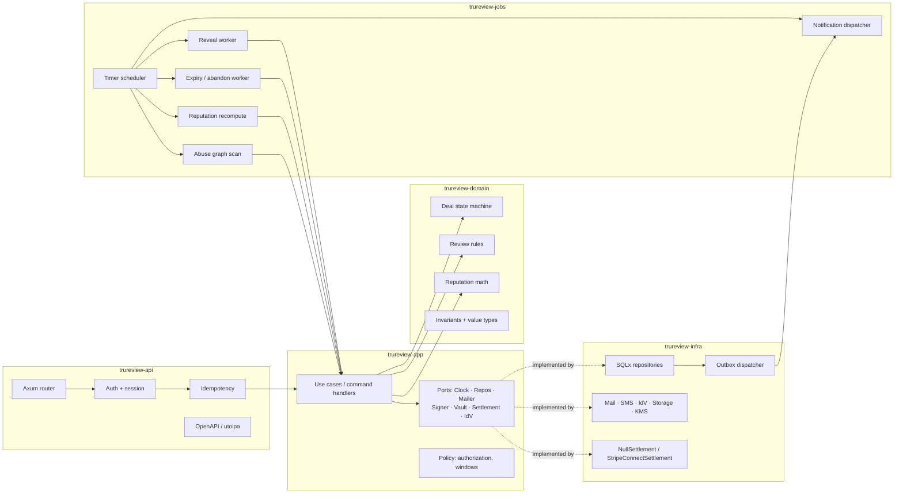
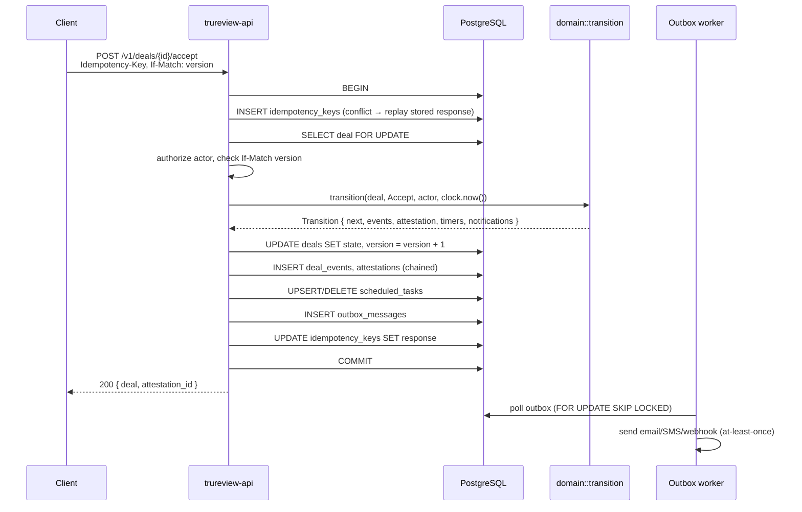

# TruReview — Architecture

> **Status note.** This document describes the *reputation layer* — the part that
> turns finished handshakes into a portable score. It is design, not code: the
> built system today is True Handshake itself (AI-witnessed capture, frozen
> agreements, escrow, verifiable receipts). See [`../README.md`](../README.md)
> for what actually runs. Where this document says "TruReview", read "the
> reputation layer of True Handshake".


Companion to [`../README.md`](../README.md) (what the product does) and
[`TRUST-MODEL.md`](TRUST-MODEL.md) (how reputation and abuse resistance work).
This document covers system structure, the domain model, storage, the settlement
seam, the frontend, and operations.

---

## Contents

- [Architectural principles](#architectural-principles)
- [System context](#system-context)
- [Component map](#component-map)
- [Crate structure](#crate-structure)
- [Domain model](#domain-model)
- [The attestation chain](#the-attestation-chain)
- [Data model](#data-model)
- [Command flow](#command-flow)
- [Scheduling and durable timers](#scheduling-and-durable-timers)
- [The reveal protocol](#the-reveal-protocol)
- [The settlement seam](#the-settlement-seam)
- [Frontend architecture](#frontend-architecture)
- [Security](#security)
- [Privacy and erasure](#privacy-and-erasure)
- [Observability](#observability)
- [Deployment](#deployment)
- [Testing strategy](#testing-strategy)
- [Deliberate trade-offs](#deliberate-trade-offs)

---

## Architectural principles

1. **The domain is pure.** `trureview-domain` has no async runtime, no database,
   no clock, no network. State machines and scoring are total functions over
   values. Everything trust-bearing is unit-testable in microseconds.
2. **State and history commit together.** No transition exists without its event
   row, in the same transaction. Auditability is not an add-on that can drift.
3. **Time is a dependency.** A `Clock` port is injected everywhere. A product
   made almost entirely of deadlines cannot have `Utc::now()` sprinkled through
   its logic and remain testable.
4. **Boring infrastructure, interesting invariants.** PostgreSQL does queueing,
   scheduling, and locking. Complexity is spent on correctness of the trust
   model, not on operating a message broker in month one.
5. **Every external dependency is a port.** Mail, SMS, storage, identity
   verification, and settlement are traits in `trureview-app`, implemented in
   `trureview-infra`. The escrow upgrade path exists because of this, not despite
   it.
6. **Fail closed on trust, fail open on convenience.** If the reveal scheduler is
   down, reviews stay sealed. If the mailer is down, deals still progress.

---

## System context

```mermaid
flowchart TB
    subgraph clients [Clients]
        WEB[React SPA<br/>Vite + Tailwind]
        API_C[Partner API clients]
    end

    subgraph edge [Edge]
        CDN[CDN / static hosting]
        LB[Load balancer + TLS + WAF]
    end

    subgraph core [TruReview core]
        API[trureview-api<br/>Axum]
        JOBS[trureview-jobs<br/>scheduler + workers]
    end

    subgraph data [State]
        PG[(PostgreSQL 16<br/>state · events · queue · timers)]
        OBJ[(Object storage<br/>evidence · PDFs)]
        KMS[KMS / HSM<br/>signing + envelope keys]
    end

    subgraph ext [External]
        MAIL[Email provider]
        SMS[SMS provider]
        IDV[Identity verification]
        PSP[Payment processor<br/>v1.0, behind port]
    end

    WEB --> CDN
    WEB --> LB
    API_C --> LB
    LB --> API
    API --> PG
    API --> OBJ
    API --> KMS
    JOBS --> PG
    JOBS --> KMS
    JOBS --> MAIL
    JOBS --> SMS
    API --> IDV
    JOBS -.v1.0.-> PSP
```

Both `api` and `jobs` are stateless and horizontally scalable. All coordination
happens in PostgreSQL.

---

## Component map



The dependency arrow never points from `domain` outward. `infra` depends on
`app`'s traits; `app` depends on `domain`; `domain` depends on nothing.

---

## Crate structure

| Crate | Responsibility | Key dependencies |
| --- | --- | --- |
| `trureview-domain` | Value types, deal state machine, review eligibility, reputation math, invariants | `serde`, `time`, `rust_decimal`, `thiserror` — no I/O |
| `trureview-app` | Use cases, port traits, authorization policy, window policy | `trureview-domain`, `async-trait` |
| `trureview-infra` | SQLx repositories, outbox, KMS signer, PII vault, mail/SMS/IdV/storage/settlement adapters | `sqlx`, `aws-sdk-kms`, `reqwest` |
| `trureview-api` | Axum router, auth middleware, idempotency, rate limiting, OpenAPI, receipt rendering | `axum`, `tower-http`, `utoipa` |
| `trureview-jobs` | Durable timer scheduler and workers | `tokio`, `sqlx` |
| `trureview-cli` | Migrations, backfills, break-glass, **offline receipt verification** | `clap` |

`trureview-cli verify receipt.json` verifies a receipt's hash chain and
signature with no network and no database — the same code path a third party
would implement from the published spec. If that command can't verify it, the
receipt is worthless.

---

## Domain model

### Core types

```rust
pub struct DealId(Uuid);
pub struct AccountId(Uuid);
pub struct TermsVersion(u16);
pub struct Version(u32);              // optimistic concurrency

pub enum DealState {
    Draft, Proposed, Countered, Active, PendingConfirmation,
    Completed, Abandoned, Declined, Expired, Cancelled,
    Disputed, Resolved(DisputeOutcome),
}

pub enum Role { Initiator, Counterparty }

pub enum Side { Provider, Receiver }  // who delivers, who pays

pub struct Terms {
    pub summary: String,
    pub detail: String,
    pub amount: Option<Money>,          // informational in v1
    pub settlement_method: SettlementMethod,
    pub performance_deadline: OffsetDateTime,
    pub deliverables: Vec<Deliverable>,
    pub cancellation_policy: CancellationPolicy,
}

pub enum SettlementMethod {
    Cash, BankTransfer, PeerToPeerApp(String), Other(String),
    Escrow(SettlementProviderId),       // reserved for v1.0
}

pub enum EvidenceTier { Attested, Observed }  // Observed unlocked by escrow

pub struct Confirmation {
    pub by: AccountId,
    pub side: Side,
    pub kind: ConfirmationKind,         // Delivered | ReceivedAndPaid
    pub at: OffsetDateTime,
    pub note: Option<String>,
}
```

### The transition function

The entire lifecycle is one total function. Nothing else in the codebase is
permitted to construct a `DealState`.

```rust
pub fn transition(
    deal: &Deal,
    cmd: DealCommand,
    actor: AccountId,
    now: OffsetDateTime,
) -> Result<Transition, DomainError>;

pub struct Transition {
    pub next: DealState,
    pub events: Vec<DomainEvent>,
    pub attestation: Option<AttestationDraft>,
    pub timers: Vec<TimerRequest>,       // set and cancel
    pub notifications: Vec<NotificationIntent>,
}
```

Properties enforced here and verified by `proptest`:

- No transition out of a terminal state except `Completed → Disputed` inside the
  dispute window.
- `Active` is reachable only via `Accept`, and `Accept` always freezes terms and
  emits exactly two attestations (proposer's and accepter's).
- `Completed` requires two confirmations from **distinct** accounts covering
  **both** sides.
- Review rights are granted by, and only by, entry into a review-eligible
  terminal state.
- Every timer set by a transition is cancelled or fired by some later transition
  — no orphaned timers.
- Replaying a deal's full event log reproduces its current state exactly.

---

## The attestation chain

Each deal is an append-only, hash-linked chain. This is what makes a receipt
independently checkable rather than a claim by TruReview.

```
attestation[n].payload_hash = SHA-256( canonical_json(payload) )
attestation[n].chain_hash   = SHA-256( attestation[n-1].chain_hash
                                     || attestation[n].payload_hash )
attestation[n].signature    = Ed25519_sign(platform_key, chain_hash)
```

- **Canonical JSON** is RFC 8785 (JCS) — deterministic key ordering and number
  formatting, so an independent implementation computes byte-identical hashes.
- **Platform signing key** lives in KMS; only the digest crosses the boundary.
  Keys rotate quarterly; every attestation records its `key_id`; all historical
  public keys stay published at `/.well-known/trureview-keys.json`.
- **User-held keys** are a v1.0+ extension: a passkey-derived Ed25519 key lets a
  party counter-sign, upgrading non-repudiation from "TruReview attests they
  clicked accept" to "only their authenticator could have produced this." The
  chain format already carries an optional `party_signature` field.
- **Daily anchoring.** A Merkle tree over all chain heads is built each day; the
  signed root is published. Altering any historical attestation requires forging
  every published root since — including copies third parties already hold.

The chain is dual-purpose: tamper evidence for users, and the audit log for
operations. There is no second, privileged history.

---

## Data model

PostgreSQL 16. Simplified DDL; constraints and indexes elided for readability.

```sql
-- Identity -----------------------------------------------------------------
accounts(id, handle UNIQUE, display_name, verification_tier,
         status, created_at, deleted_at, pii_key_id)

identity_verifications(id, account_id, kind, provider, provider_ref,
                       status, verified_at, expires_at)

-- Deals --------------------------------------------------------------------
deals(id, state, current_terms_version, evidence_tier, version,
      initiator_id, counterparty_id, initiator_side,
      proposal_expires_at, performance_deadline_at,
      review_window_closes_at, revealed_at,
      created_at, terminal_at, terminal_reason)

deal_terms(deal_id, terms_version, payload JSONB, payload_hash,
           authored_by, created_at, frozen_at,
           PRIMARY KEY (deal_id, terms_version))

confirmations(id, deal_id, account_id, side, kind, note_ref, created_at,
              UNIQUE (deal_id, account_id))

-- Trust ledger -------------------------------------------------------------
attestations(id, deal_id, seq, actor_id, action, terms_version,
             payload_hash, chain_hash, prev_chain_hash,
             key_id, signature, party_signature, created_at,
             UNIQUE (deal_id, seq))

deal_events(id BIGSERIAL, deal_id, seq, kind, payload JSONB,
            actor_id, occurred_at, UNIQUE (deal_id, seq))

merkle_anchors(id, period_date, root_hash, key_id, signature,
               head_count, published_at)

-- Reviews ------------------------------------------------------------------
reviews(id, deal_id, author_id, subject_id,
        sealed_payload BYTEA, sealed_key_ref, submitted_at,
        revealed_at, ratings JSONB, body_ref,
        context_badges JSONB, status,
        UNIQUE (deal_id, author_id))

review_amendments(id, review_id, prev_ratings, prev_body_ref, created_at)
review_replies(id, review_id, author_id, body_ref, created_at)

-- Disputes -----------------------------------------------------------------
disputes(id, deal_id, opened_by, tier, status, outcome,
         opened_at, self_resolution_deadline, mediation_deadline, closed_at)

dispute_evidence(id, dispute_id, seq, submitted_by, kind,
                 object_ref, payload_hash, chain_hash, created_at)

-- Reputation ---------------------------------------------------------------
reputation_snapshots(account_id, score, band, deal_count, subscores JSONB,
                     inputs_hash, computed_at, PRIMARY KEY (account_id))

reputation_inputs(account_id, review_id, weight, weight_breakdown JSONB,
                  computed_at)

-- Abuse --------------------------------------------------------------------
abuse_signals(id, subject_type, subject_id, signal, score, detail JSONB,
              detected_at)
cluster_flags(id, member_ids UUID[], reason, weight_multiplier,
              status, flagged_at, appealed_at)

-- Infrastructure -----------------------------------------------------------
scheduled_tasks(id, kind, deal_id, due_at, state, attempts,
                locked_until, locked_by, payload JSONB, dedup_key UNIQUE)

outbox_messages(id BIGSERIAL, topic, payload JSONB, created_at,
                published_at, attempts, next_attempt_at)

idempotency_keys(key, account_id, endpoint, request_hash,
                 response_status, response_body, created_at, expires_at,
                 PRIMARY KEY (key, account_id))

pii_vault(id, subject_account_id, key_id, ciphertext BYTEA, created_at)
```

Notes on shape:

- **`deal_events` is the source of truth for history**; the columns on `deals`
  are a maintained projection. `trureview-cli replay --deal <id>` rebuilds state
  from events and asserts equality with the stored row — run in CI against a
  production snapshot.
- **`body_ref` / `note_ref` / `object_ref` point into `pii_vault` or object
  storage**, never inline free text. This is what makes crypto-shredding work.
- **`sealed_payload` is envelope-encrypted** under a per-deal reveal DEK. The
  DEK is wrapped by KMS under a policy that only the reveal worker's role can
  unwrap, and only after `review_window_closes_at` or a both-submitted marker.
- **`(deal_id, seq)` uniqueness** on attestations and events is the concurrency
  backstop: two racing writers cannot both append seq N.

---

## Command flow

Every mutating request takes the same path.



Everything trust-bearing is inside one transaction. Everything outside it —
notifications, webhooks, reputation recompute — is at-least-once and idempotent.

Rejections are explicit and typed: `409` on version mismatch (body carries
current state), `422` on an illegal transition (body names the rule), `403` when
the actor isn't a participant or lacks the role for that command.

---

## Scheduling and durable timers

Deadlines *are* the product. They get first-class infrastructure rather than a
cron job scanning tables.

- **`scheduled_tasks` is the timer store.** A transition returns `TimerRequest`s
  and the same transaction inserts or cancels rows. Setting a deadline is as
  atomic as the state change that caused it.
- **Claiming** uses `SELECT ... WHERE due_at <= now() AND state = 'pending'
  ORDER BY due_at FOR UPDATE SKIP LOCKED LIMIT n`, then sets `locked_until`.
  Multiple worker replicas are safe.
- **`dedup_key`** (e.g. `deal:{id}:review_reveal`) makes timer creation
  idempotent under retry.
- **Firing is a command,** not a special path. A timer invokes the same use case
  a user would, with a `System` actor. There is no privileged transition code.
- **Late firing is safe.** Workers evaluate against the *logical* due time. A
  worker that resumes six hours late reveals reviews as of the correct instant
  and marks the lateness on the event.
- **Outage-aware extension.** A tracked provider outage overlapping a deadline
  extends it by the outage duration, recorded on the deal so the extension is
  visible rather than mysterious.

Timer kinds: `proposal_expiry`, `performance_deadline`, `confirmation_window`,
`auto_abandon`, `review_window_close`, `review_reveal`, `edit_cooling_end`,
`amendment_window_close`, `dispute_self_resolution_deadline`,
`dispute_mediation_deadline`, `reminder_{t72,t24,t2}`.

---

## The reveal protocol

The strongest confidentiality claim in the system: even TruReview operators
cannot read a sealed review before reveal. Mechanism:

1. On deal entry to a review-eligible terminal state, a per-deal **reveal DEK**
   is generated and wrapped by KMS under a key policy naming the reveal worker's
   role as the only principal permitted to `Decrypt`, gated by an encryption
   context containing the deal id.
2. Submitted reviews are encrypted client-side of the database with that DEK.
   `trureview-api`'s role can `Encrypt` but not `Decrypt`.
3. Reveal is triggered by whichever fires first:
   - both parties' reviews present (checked in the submit transaction), or
   - the `review_window_close` timer,
   and is blocked while a dispute is open.
4. The reveal worker unwraps the DEK, decrypts, writes plaintext ratings and a
   vaulted body reference, sets `revealed_at`, appends an attestation, and
   destroys its copy of the DEK.

Break-glass decryption exists for legal compulsion. It requires two-person
authorization, writes an `abuse_signals`-adjacent audit row, pages security, and
**surfaces a notice on the affected deal to both parties**. An unloggable
privileged path is not offered.

---

## The settlement seam

v1 handles no money. The seam that makes escrow a later adapter rather than a
rewrite:

```rust
#[async_trait]
pub trait SettlementProvider: Send + Sync {
    fn id(&self) -> SettlementProviderId;
    fn evidence_tier(&self) -> EvidenceTier;

    /// Called on Accept. Attestation-only returns Declared and does nothing.
    async fn arrange(&self, deal: &DealSnapshot) -> Result<SettlementHandle>;

    /// Called on confirmation. Attestation-only records the claim.
    async fn on_confirmation(&self, h: &SettlementHandle, c: &Confirmation)
        -> Result<SettlementState>;

    /// Called on terminal state. Escrow releases or refunds here.
    async fn finalize(&self, h: &SettlementHandle, outcome: DealOutcome)
        -> Result<SettlementState>;

    /// Provider-observed facts (webhooks) → domain events.
    async fn ingest_event(&self, raw: ProviderEvent) -> Result<Vec<DomainEvent>>;
}
```

- **v1: `NullSettlement`.** `evidence_tier() == Attested`. Confirmations are
  recorded as signed claims. No funds, no PSP, no KYC, no money-transmitter
  exposure.
- **v1.0: `StripeConnectSettlement`.** `evidence_tier() == Observed`. Funds are
  custodied and released by the processor; TruReview orchestrates and records.
  Deal states are unchanged — `Completed` still means both parties confirmed;
  what changes is that one confirmation is now corroborated by an observed
  transfer, which flows into the receipt as a stronger evidence tier and into
  reputation as a higher-confidence input.

The domain never learns what a processor is. `EvidenceTier` is the only concept
that crosses the boundary, and it already exists in v1 with one variant used.

---

## Frontend architecture

**React 18 + TypeScript + Vite + Tailwind CSS.** A single-page app served as
static assets from a CDN, talking to the same public REST API as any partner
client — no privileged back door.

### Stack

| Concern | Choice | Why |
| --- | --- | --- |
| Build | Vite | Fast HMR, first-class TS, trivial static output |
| Language | TypeScript, strict | API types generated from OpenAPI — the Rust types are the schema source |
| Routing | React Router (data routers) | Loader-based fetching, nested deal views |
| Server state | TanStack Query | Caching, background refetch, mutation retry with idempotency keys |
| Client state | Zustand for the little that isn't server state | Avoids a Redux-shaped ceremony tax |
| Styling | Tailwind CSS + CSS variables for theming | Design tokens live in `tailwind.config.ts`; light/dark via `data-theme` |
| Components | Headless UI + Radix primitives, styled with Tailwind | Accessible dialogs/menus/tabs without inheriting a design system |
| Forms | React Hook Form + Zod | Zod schemas generated alongside API types; client validation mirrors domain rules |
| Dates | Temporal polyfill / `date-fns-tz` | The app is entirely deadlines; timezone correctness is not optional |
| Tests | Vitest + Testing Library + Playwright | Unit, component, and end-to-end lifecycle flows |

### Structure

```
web/
├── src/
│   ├── api/            generated client + typed hooks (openapi-typescript)
│   ├── features/
│   │   ├── deals/      compose, negotiate, timeline, confirm
│   │   ├── reviews/    sealed compose, reveal, reply, amend
│   │   ├── disputes/   evidence, exchange, outcome
│   │   ├── profile/    reputation, evidence-linked review list
│   │   └── receipts/   viewer + public verification page
│   ├── components/     shared primitives (Button, Badge, Countdown, Timeline)
│   ├── lib/            time, formatting, verification (WebCrypto)
│   └── routes/
├── tailwind.config.ts
└── vite.config.ts
```

### Design system in Tailwind

Semantic tokens, not raw palette utilities scattered through JSX. `bg-surface`,
`text-muted`, `border-subtle`, `text-state-active`, `text-state-disputed` map to
CSS variables redefined under `[data-theme="dark"]` and
`prefers-color-scheme: dark`. Deal states get one canonical color mapping used
everywhere — a `Disputed` badge is the same color in a list row, a timeline
node, and a receipt.

### Frontend behavior characteristics

- **Deadlines are live.** Countdowns tick client-side against a **server-anchored
  clock**: every response carries `Date`, and the client tracks the offset. A
  user with a wrong system clock still sees correct time remaining, and the
  client never decides that a window has closed — it asks the server.
- **Optimistic UI stops at the trust boundary.** List filters and drafts update
  optimistically. Accept, confirm, dispute, and submit-review never do: they show
  a pending state and wait for the attestation id. Showing "accepted" before the
  chain says so is exactly the lie the product exists to prevent.
- **Idempotency keys are generated per mutation attempt** and reused across
  retries, so a flaky connection cannot double-accept a deal.
- **409 is a first-class UI state,** not an error toast. When the deal moved
  underneath you, the app refetches and renders a diff — "Bob countered while you
  were reviewing" — rather than blaming the user.
- **The sealed-review composer is explicit about blindness.** It states that the
  counterparty's review is unreadable, shows the reveal condition, and shows the
  window countdown. Users trust double-blind only if the UI makes the mechanism
  legible.
- **Receipt verification runs in the browser.** The public receipt page verifies
  the hash chain and Ed25519 signature with WebCrypto against the published key,
  client-side. Verification that only the server can perform isn't verification.
- **Accessible by construction.** WCAG 2.2 AA: keyboard-navigable timelines,
  labeled live regions for countdowns, state never conveyed by color alone
  (every state badge carries an icon and text), reduced-motion respected.
- **Progressive disclosure of legal weight.** Irreversible actions — accept,
  confirm, submit review — use a distinct confirmation pattern that restates the
  frozen terms hash and what the action attests to.

---

## Security

- **Authentication:** passkeys (WebAuthn) preferred, email OTP fallback. Sessions
  are opaque server-side tokens in `HttpOnly; Secure; SameSite=Lax` cookies,
  30-day sliding, revocable per device. No JWTs holding authorization state.
- **Authorization** is a domain concern, evaluated in `trureview-app::policy`
  against the deal's participants and the actor's role. Route-level guards are a
  second layer, never the only one.
- **Step-up authentication** on high-consequence actions: accepting a deal above
  a value threshold, opening a dispute, changing payout or contact details.
- **Rate limiting** per account, per IP, and per endpoint class, tightened for
  unverified accounts. Deal creation and review submission carry their own,
  stricter budgets.
- **Input handling:** review and evidence text is stored raw and rendered as
  plain text; no HTML rendering path exists for user content. Uploads are
  content-sniffed, size-capped, stripped of EXIF, and served from a separate
  origin with `Content-Disposition: attachment`.
- **Secrets** live in KMS/Secrets Manager; nothing sensitive in environment
  variables beyond references. Signing keys never leave KMS.
- **Supply chain:** `cargo-deny` and `cargo-audit` in CI, `npm audit` +
  lockfile-only installs for the frontend, pinned toolchains, SBOM per release.
- **Headers:** strict CSP with no `unsafe-inline` (hashed styles), HSTS preload,
  `Permissions-Policy` denying everything unused.

---

## Privacy and erasure

The tension: an immutable, hash-chained ledger versus a legal right to erasure.
Resolved by keeping personal data out of the chain entirely.

- The chain contains **hashes of canonical payloads**, and payloads reference
  vault ids — never raw names, emails, or free text.
- `pii_vault` rows are encrypted under **per-subject data keys**.
- **Erasure destroys the subject's data key.** The chain stays intact and
  verifiable; the content becomes cryptographically unrecoverable; receipts and
  reviews render a tombstone (`[content removed at the author's request]`) with
  the ratings and structural facts preserved.
- **Retention:** deal records and attestations are kept 7 years (evidentiary
  value is the entire point); operational logs 90 days; raw device and IP
  signals 180 days; identity-verification artifacts are held by the IdV provider,
  not by TruReview — we store only the tier, provider reference, and timestamp.
- **Data export** returns everything about the account: deals, receipts, reviews
  written and received, reputation inputs with their weight breakdowns.

---

## Observability

- **Tracing:** `tracing` + OpenTelemetry, one span per command, with `deal_id`,
  `actor_id`, `command`, `from_state`, `to_state`, and `attestation_seq` on every
  transition span. A deal's entire life is reconstructible from traces.
- **Golden signals per command class,** not just per HTTP route — "accept deal"
  latency matters; "POST /v1/deals/{id}/accept" is a proxy for it.
- **Domain metrics that catch integrity bugs:**
  `reveal_lateness_seconds` (alert on any early reveal — that is a P1),
  `timer_fire_delay_seconds`, `outbox_lag_seconds`,
  `chain_verification_failures` (must be zero),
  `replay_mismatches` (must be zero),
  `deals_abandoned_ratio`, `dispute_rate`, `reputation_recompute_lag`.
- **Continuous chain audit.** A background job re-verifies a rolling sample of
  attestation chains and every day's Merkle anchor. Any mismatch pages
  immediately; silent corruption of the trust ledger is the worst failure the
  system has.

---

## Deployment

- **Artifacts:** two container images (`api`, `jobs`) from a shared multi-stage
  build; frontend is a static bundle to CDN with immutable hashed assets.
- **Environments:** `dev` → `staging` (production-shaped, synthetic data,
  accelerated clock for lifecycle rehearsal) → `production`.
- **Migrations** are expand/contract, applied before the deploy that needs them,
  always backward-compatible for one release.
- **Rollout:** rolling deploy for `api`; `jobs` drains claimed tasks before
  shutdown (`locked_until` guarantees safety even on hard kill).
- **Backups:** PITR with a 30-day window plus daily snapshots to a separate
  account. **Restore is rehearsed monthly** — a trust ledger you have never
  restored is a trust ledger you do not have.
- **Config** via environment with a typed, fail-fast loader: the process refuses
  to start on a missing or malformed setting rather than defaulting to something
  quietly wrong.

---

## Testing strategy

| Layer | Approach |
| --- | --- |
| Domain | Exhaustive unit tests per transition; `proptest` for invariants (no orphaned timers, replay equivalence, terminal-state immutability, review eligibility) |
| Reputation | Property tests for monotonicity and bounds; golden-file tests on fixed corpora so scoring changes are visible in review diffs |
| Repositories | Integration tests against real PostgreSQL (`sqlx::test`), including concurrency tests that fire two racing commands at one deal |
| Time | Simulated clock drives full lifecycles — propose → expire, accept → abandon, dispute → reveal — in milliseconds |
| Reveal | Dedicated adversarial suite: attempt read pre-reveal by every role; assert failure. Any early reveal fails the build |
| API | Contract tests generated from the OpenAPI schema; idempotency and version-conflict suites |
| Frontend | Vitest + Testing Library for components; Playwright for the two full journeys (happy-path deal→reveal, and dispute→resolution) against a seeded backend |
| Verification | `trureview-cli verify` must validate every receipt fixture, plus an independent verifier script written from the published spec alone |

---

## Deliberate trade-offs

| Decision | Chosen | Rejected | Reasoning |
| --- | --- | --- | --- |
| Money in v1 | Attestation only | Full escrow | Escrow means licensing, KYC/AML, ledgering, and chargeback handling. The reputation product is valuable without it, and the settlement port preserves the upgrade. |
| History | State + append-only hash-chained event log | Full event sourcing | Get auditability and replay without CQRS projections and versioned-event migration pain. `replay` in CI keeps the log honest. |
| Queue/scheduler | PostgreSQL `SKIP LOCKED` | Kafka / SQS / Temporal | One durable store, transactional enqueue with state changes, no extra operational surface. Revisit past ~10⁴ timers/minute; the port makes the swap contained. |
| Review reveal | Sealed + scheduled reveal | Publish on submit | The single highest-leverage anti-retaliation decision. Costs a scheduler and an encryption path. |
| Reputation | Batch snapshot, eventually consistent | Real-time recompute | Scoring is graph-dependent and adversarially sensitive; batch permits cluster analysis and rollback of a bad model. Deal state stays strongly consistent. |
| Tamper evidence | Hash chain + signed daily Merkle roots | Public blockchain | Same practical guarantee for two-party receipts, no token, no fees, no throughput ceiling, no chain-selection politics. |
| Frontend data | REST + TanStack Query | GraphQL | Resource-shaped domain, small client surface, and the public API doubles as the partner API. GraphQL's flexibility isn't earned here. |
| Erasure | Crypto-shredding | Row deletion | Preserves chain verifiability while making content genuinely unrecoverable. |

---

## Open questions

1. **Cross-account identity resolution.** When Alice deals with "Bob" who has two
   accounts, should reputation merge on verified identity? Merging is powerful and
   is also a deanonymization vector.
2. **Category-specific terms templates.** Freelance work, used-goods sales, and
   private services want different terms shapes. One generic schema, or typed
   deal categories with per-category review dimensions?
3. **Portability.** Should reputation be exportable as a signed, third-party
   verifiable credential (W3C VC)? Attractive for user ownership; erodes the
   moat; raises the stakes on scoring errors.
4. **Mediator supply.** Staff-only mediation doesn't scale; a peer mediator pool
   needs its own trust and incentive design — plausibly a second reputation
   system, which deserves its own doc before it deserves any code.
